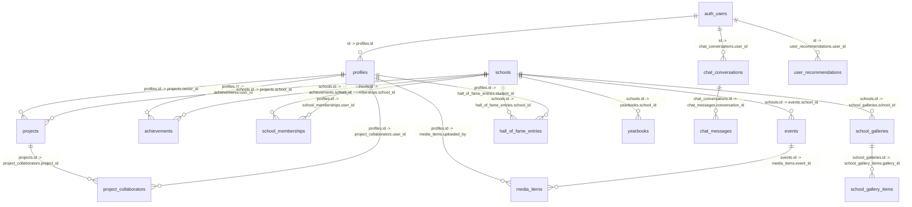

## Entity-Relationship Diagram

Notes
- RLS is enabled across tables; admins get elevated access via `public.has_role`.
- `project_collaborators` replaces the legacy `projects.collaborators` array.

