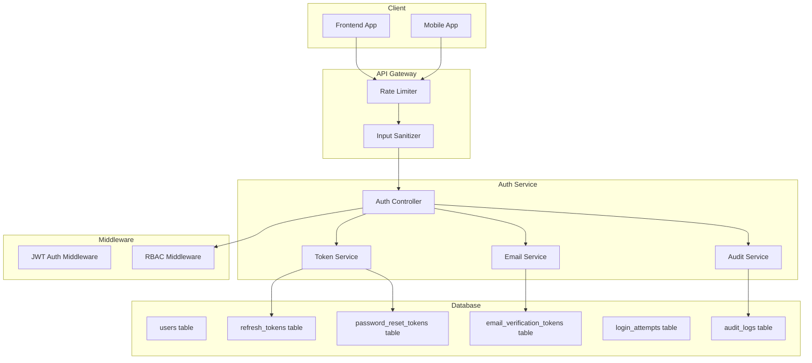
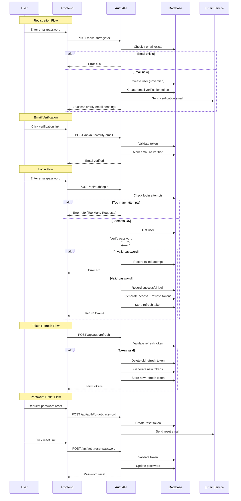

# Backend Rebuild & Improved Authentication System

## Overview

This plan outlines the complete rebuild of the backend with a new and improved authentication system featuring:
- Enhanced JWT with refresh token rotation
- Email verification with token-based confirmation
- Password reset functionality with secure tokens
- Rate limiting for brute force protection
- Comprehensive audit logging

---

## Architecture Diagram



---

## New Authentication Flow



---

## Database Schema Changes

### New Tables

```sql
-- Email verification tokens table
CREATE TABLE IF NOT EXISTS email_verification_tokens (
    id SERIAL PRIMARY KEY,
    user_id INTEGER REFERENCES users(id) ON DELETE CASCADE,
    token VARCHAR(255) UNIQUE NOT NULL,
    expires_at TIMESTAMP WITH TIME ZONE NOT NULL,
    created_at TIMESTAMP WITH TIME ZONE DEFAULT CURRENT_TIMESTAMP
);

-- Password reset tokens table
CREATE TABLE IF NOT EXISTS password_reset_tokens (
    id SERIAL PRIMARY KEY,
    user_id INTEGER REFERENCES users(id) ON DELETE CASCADE,
    token VARCHAR(255) UNIQUE NOT NULL,
    expires_at TIMESTAMP WITH TIME ZONE NOT NULL,
    used_at TIMESTAMP WITH TIME ZONE,
    created_at TIMESTAMP WITH TIME ZONE DEFAULT CURRENT_TIMESTAMP
);

-- Login attempts tracking for brute force protection
CREATE TABLE IF NOT EXISTS login_attempts (
    id SERIAL PRIMARY KEY,
    email VARCHAR(255) NOT NULL,
    ip_address VARCHAR(45),
    user_agent TEXT,
    success BOOLEAN DEFAULT false,
    created_at TIMESTAMP WITH TIME ZONE DEFAULT CURRENT_TIMESTAMP
);

-- User table enhancement
ALTER TABLE users ADD COLUMN IF NOT EXISTS email_verified BOOLEAN DEFAULT false;
ALTER TABLE users ADD COLUMN IF NOT EXISTS last_login_at TIMESTAMP WITH TIME ZONE;
ALTER TABLE users ADD COLUMN IF NOT EXISTS failed_login_attempts INTEGER DEFAULT 0;
ALTER TABLE users ADD COLUMN IF NOT EXISTS locked_until TIMESTAMP WITH TIME ZONE;

-- Create indexes
CREATE INDEX IF NOT EXISTS idx_email_verification_tokens_token ON email_verification_tokens(token);
CREATE INDEX IF NOT EXISTS idx_email_verification_tokens_user ON email_verification_tokens(user_id);
CREATE INDEX IF NOT EXISTS idx_password_reset_tokens_token ON password_reset_tokens(token);
CREATE INDEX IF NOT EXISTS idx_password_reset_tokens_user ON password_reset_tokens(user_id);
CREATE INDEX IF NOT EXISTS idx_login_attempts_email ON login_attempts(email);
CREATE INDEX IF NOT EXISTS idx_login_attempts_created ON login_attempts(created_at);
```

---

## Authentication System Features

### 1. Enhanced JWT Token System

- **Access Token**: 15-minute expiry (shorter for better security)
- **Refresh Token**: 7-day expiry with rotation (new token on each refresh)
- Token claims include: `id`, `email`, `role`, `school_id`, `iat`, `exp`

### 2. Email Verification

- Token-based verification (not link-based for security)
- 24-hour expiry for verification tokens
- Resend verification email capability
- Rate limiting on verification requests

### 3. Password Reset

- Secure token-based reset flow
- 1-hour expiry for reset tokens
- Token can only be used once
- Email notification on password change

### 4. Rate Limiting

- Login attempts: 5 per 15 minutes per IP
- Register attempts: 10 per hour per IP
- Forgot password: 3 per hour per IP
- Token refresh: 100 per hour per user

### 5. Audit Logging

All authentication events are logged:
- Login attempts (success/failure)
- Logout events
- Password changes
- Email verification
- Password reset requests
- Token refreshes
- Suspicious activity detection

### 6. Security Enhancements

- Account lockout after 5 failed attempts (15 minutes)
- Password strength validation (8+ chars, uppercase, lowercase, number, special)
- Session management (track device/browser)
- IP-based login anomaly detection
- Secure password hashing with bcrypt (12 rounds)

---

## API Endpoints

### Authentication Endpoints

| Method | Endpoint | Description | Auth Required |
|--------|----------|-------------|---------------|
| POST | /api/auth/register | Register new user | No |
| POST | /api/auth/login | Login with email/password | No |
| POST | /api/auth/logout | Logout (invalidate token) | Yes |
| POST | /api/auth/logout-all | Logout from all devices | Yes |
| POST | /api/auth/refresh | Refresh access token | No |
| POST | /api/auth/forgot-password | Request password reset | No |
| POST | /api/auth/reset-password | Reset password with token | No |
| POST | /api/auth/verify-email | Verify email with token | No |
| POST | /api/auth/resend-verification | Resend verification email | No |
| GET | /api/auth/me | Get current user | Yes |
| PUT | /api/auth/profile | Update profile | Yes |
| PUT | /api/auth/password | Change password | Yes |

---

## Docker Configuration Updates

### Dockerfile Improvements

- Multi-stage build for smaller image
- Non-root user for security
- Health check endpoint
- Environment variable validation
- Build-time secrets handling

### docker-compose.yml Updates

- Separate production and development configs
- Resource limits for containers
- Health checks for all services
- Proper volume management
- Network isolation

---

## Implementation Steps

1. **Delete existing Docker resources**
   - Stop running containers
   - Remove existing containers
   - Remove existing images

2. **Update database schema**
   - Create new auth-related tables
   - Add new columns to users table
   - Run migrations

3. **Build new authentication service**
   - Create auth service layer
   - Implement token generation/validation
   - Add email verification logic
   - Implement password reset flow
   - Add rate limiting middleware
   - Enhance audit logging

4. **Update controllers and routes**
   - New auth controller with all endpoints
   - Updated validation middleware
   - Enhanced error handling

5. **Update Docker configuration**
   - Improve Dockerfile
   - Update docker-compose.yml
   - Add health checks

6. **Build and deploy**
   - Build new Docker image
   - Create new container
   - Test authentication flow

---

## Security Considerations

1. **Token Security**
   - Store refresh tokens in database (not just cookies)
   - Implement token rotation (invalidate old on refresh)
   - Short-lived access tokens (15 min)
   - Secure token storage recommendations for frontend

2. **Password Security**
   - bcrypt with 12 rounds
   - Strong password requirements
   - No password in logs
   - Password change notification

3. **Account Security**
   - Login attempt tracking
   - Account lockout mechanism
   - Suspicious activity alerts
   - Session timeout

4. **API Security**
   - Rate limiting on all auth endpoints
   - Input sanitization
   - SQL injection prevention
   - XSS protection headers

---

## Files to Modify/Create

### Modified Files
- `backend/src/controllers/auth.controller.ts`
- `backend/src/middleware/auth.middleware.ts`
- `backend/src/routes/auth.routes.ts`
- `backend/init.sql`
- `backend/Dockerfile`
- `docker-compose.yml`

### New Files
- `backend/src/services/auth.service.ts`
- `backend/src/services/email.service.ts`
- `backend/src/services/audit.service.ts`
- `backend/migrations/003_email_verification.sql`
- `backend/migrations/004_password_reset.sql`
- `backend/migrations/005_login_attempts.sql`

---

## Testing Plan

1. **Unit Tests**
   - Token generation/validation
   - Password hashing/verification
   - Input validation
   - Rate limiting logic

2. **Integration Tests**
   - Full registration flow
   - Login/logout flow
   - Token refresh flow
   - Password reset flow
   - Email verification flow

3. **Security Tests**
   - Brute force protection
   - Token forgery attempts
   - SQL injection prevention
   - XSS prevention

---

## Rollback Plan

If issues arise:
1. Keep backup of old Docker images
2. Database migrations are backward compatible
3. Feature flags for gradual rollout
4. Quick revert to previous version via Docker tag
