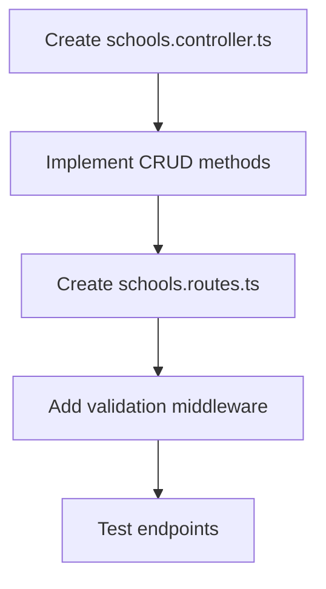
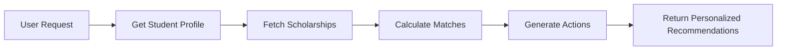

# Growth Forge AI - Feature Completion Plan

## Overview
This plan outlines the steps to complete three key incomplete features:
1. Schools Module (Backend CRUD + Frontend Integration)
2. Email Service (SMTP Configuration)
3. Recommendations (AI Enhancement)

---

## 1. Schools Module Completion

### Current State
- **Database**: `schools` table exists with basic columns (id, name, location, education_system, description, logo_url, created_by, created_at, updated_at, deleted_at)
- **Backend**: `school-gallery.controller.ts` exists but only handles events, not school CRUD
- **Frontend**: `SchoolProfile.tsx` uses mock data
- **Missing**: School CRUD controller, routes, and API integration

### Implementation Plan

#### Phase 1: Backend CRUD Operations


**Files to Create/Modify:**
1. **Create**: `backend/src/controllers/schools.controller.ts`
   - `getSchools()` - List all schools (with pagination & search)
   - `getSchool()` - Get single school by ID
   - `createSchool()` - Create new school (admin only)
   - `updateSchool()` - Update school (admin only)
   - `deleteSchool()` - Soft delete school (admin only)
   - `getSchoolStats()` - Get school statistics
   - `getSchoolUsers()` - Get users belonging to school

2. **Create**: `backend/src/routes/schools.routes.ts`
   - `GET /api/schools` - List schools
   - `GET /api/schools/:id` - Get school details
   - `POST /api/schools` - Create school
   - `PUT /api/schools/:id` - Update school
   - `DELETE /api/schools/:id` - Delete school
   - `GET /api/schools/:id/stats` - Get school statistics
   - `GET /api/schools/:id/users` - Get school users

3. **Update**: `backend/src/server.ts`
   - Import and mount schools routes

#### Phase 2: Database Migration
```sql
-- Add missing columns to schools table
ALTER TABLE schools ADD COLUMN IF NOT EXISTS type VARCHAR(100);
ALTER TABLE schools ADD COLUMN IF NOT EXISTS level VARCHAR(100);
ALTER TABLE schools ADD COLUMN IF NOT EXISTS curriculum TEXT[];
ALTER TABLE schools ADD COLUMN IF NOT EXISTS contact_email VARCHAR(255);
ALTER TABLE schools ADD COLUMN IF NOT EXISTS contact_phone VARCHAR(50);
ALTER TABLE schools ADD COLUMN IF NOT EXISTS address TEXT;
ALTER TABLE schools ADD COLUMN IF NOT EXISTS banner_url VARCHAR(255);
ALTER TABLE schools ADD COLUMN IF NOT EXISTS website VARCHAR(255);
ALTER TABLE schools ADD COLUMN IF NOT EXISTS is_active BOOLEAN DEFAULT true;
```

#### Phase 3: Frontend Integration
**Files to Modify:**
1. **Update**: `src/pages/SchoolProfile.tsx`
   - Replace mock data with API calls
   - Add loading states
   - Add error handling

2. **Create**: `src/services/schools.ts`
   - API service for school endpoints

3. **Create/Update**: `src/pages/Schools.tsx`
   - School listing page with search/filter

4. **Update**: `src/pages/SchoolGallery.tsx`
   - Integrate with real school data

---

## 2. Email Service Configuration

### Current State
- **Service**: `email.service.ts` exists with HTML templates
- **Functionality**: Only logs emails in development mode
- **Missing**: Real SMTP integration

### Implementation Plan

#### Phase 1: Choose Email Provider
**Options:**
1. **Nodemailer (SMTP)** - Self-hosted, free
2. **SendGrid** - Cloud-based, scalable
3. **AWS SES** - Enterprise-grade
4. **Resend** - Modern, developer-friendly

**Recommendation**: Start with Nodemailer for development, upgrade to SendGrid/AWS SES for production

#### Phase 2: Environment Variables
```env
# Email Configuration
EMAIL_PROVIDER=smtp
SMTP_HOST=smtp.gmail.com
SMTP_PORT=587
SMTP_USER=your-email@gmail.com
SMTP_PASS=your-app-password
EMAIL_FROM=noreply@growthforge.ai
EMAIL_FROM_NAME=Growth Forge AI
```

#### Phase 3: Update Email Service
```typescript
// backend/src/services/email.service.ts modifications

// Add SMTP transporter configuration
private transporter: any;

constructor() {
    // ... existing code ...
    this.transporter = nodemailer.createTransport({
        host: process.env.SMTP_HOST,
        port: Number(process.env.SMTP_PORT),
        secure: false,
        auth: {
            user: process.env.SMTP_USER,
            pass: process.env.SMTP_PASS,
        },
    });
}

async sendEmail(options: EmailOptions): Promise<boolean> {
    // Development mode - log email
    if (process.env.NODE_ENV !== 'production') {
        console.log('📧 [DEV] Email:', options);
        return true;
    }

    // Production mode - send real email
    try {
        await this.transporter.sendMail({
            from: `"${this.fromName}" <${this.fromEmail}>`,
            to: options.to,
            subject: options.subject,
            html: options.html,
            text: options.text,
        });
        return true;
    } catch (error) {
        console.error('Failed to send email:', error);
        return false;
    }
}
```

#### Phase 4: Add New Email Templates
- Welcome email
- Achievement verified notification
- Project feedback notification
- School invitation email

---

## 3. Recommendations Enhancement

### Current State
- **Basic Implementation**: `recommendations.routes.ts` returns hardcoded actions
- **AI Integration**: `ai-chat.service.ts` has scholarship matching algorithm
- **Missing**: Full recommendations API, personalized recommendations

### Implementation Plan

#### Phase 1: Enhance Recommendations API


**Enhancements:**
1. **Update**: `backend/src/routes/recommendations.routes.ts`
   - Add student profile analysis
   - Implement personalized recommendations
   - Add scholarship eligibility scoring
   - Include skill gap analysis

2. **Create**: `backend/src/services/recommendations.service.ts`
   - Scholarship matching algorithm
   - Action item generation
   - Skill recommendations
   - Achievement suggestions

#### Phase 2: New Endpoints
```typescript
// Recommended endpoints
router.get('/scholarships', getMatchingScholarships);
router.get('/actions', getPersonalizedActions);
router.get('/skills', getSkillRecommendations);
router.get('/achievements', getAchievementSuggestions);
router.get('/profile-completeness', getProfileCompleteness);
```

#### Phase 3: Frontend Integration
1. **Create**: `src/pages/Recommendations.tsx`
   - Dashboard widget for recommendations
   - Scholarship matches display
   - Action items list

2. **Update**: `src/pages/Dashboard.tsx`
   - Add recommendations section

---

## Implementation Priority & Timeline

### Week 1: Schools Module
| Day | Task | Files |
|-----|------|-------|
| 1-2 | Backend CRUD | schools.controller.ts, schools.routes.ts |
| 3 | Database migration | backend/migrations/ |
| 4-5 | Frontend integration | SchoolProfile.tsx, Schools.tsx |

### Week 2: Email Service
| Day | Task | Files |
|-----|------|-------|
| 1-2 | SMTP setup | email.service.ts, .env |
| 3-4 | Test templates | All email methods |
| 5 | Add new templates | Welcome, notification emails |

### Week 3: Recommendations
| Day | Task | Files |
|-----|------|-------|
| 1-2 | Enhance backend | recommendations.routes.ts |
| 3-4 | Create service | recommendations.service.ts |
| 5 | Frontend integration | Recommendations.tsx, Dashboard.tsx |

---

## Testing Plan

### Schools Module
- [ ] CRUD operations
- [ ] Pagination & search
- [ ] Role-based access (admin vs teacher)
- [ ] Frontend data binding

### Email Service
- [ ] Send verification email
- [ ] Send password reset email
- [ ] Send login alerts
- [ ] Handle SMTP errors

### Recommendations
- [ ] Scholarship matching accuracy
- [ ] Personalized action items
- [ ] Performance with large datasets
- [ ] AI response quality

---

## Success Criteria

### Schools Module ✅
- Admin can create/edit/delete schools
- Users can view school profiles
- Schools have statistics (user count, achievements)
- Frontend displays real data

### Email Service ✅
- Emails are sent in production
- HTML templates render correctly
- Error handling for SMTP failures
- Test coverage > 80%

### Recommendations ✅
- Personalized scholarship matches
- Actionable improvement suggestions
- Profile completeness tracking
- Integration with SmartBuddy chat

---

## Next Steps After Feature Completion

1. **Security Audit**
   - Review all new endpoints
   - Validate input sanitization
   - Test role-based access

2. **Performance Optimization**
   - Cache scholarship data
   - Optimize database queries
   - Add pagination to all list endpoints

3. **Documentation**
   - Update API documentation
   - Add user guides
   - Create deployment guide
