# School Admin Dashboard Activation Plan

> **Full System-Level Execution Blueprint**

> **Generated:** 2026-02-23
> **Status:** Ready for Implementation

---

## Overview

This dashboard is not just another user view. It is the **institution control center**. The School Admin controls:

- Users (students, teachers, parents)
- Academic structure
- Performance data
- School analytics
- Permissions
- AI usage governance
- Institutional settings

---

## Architecture Principle

School Admin operates at **School Scope Level**. Everything they see or control must be filtered by:

```
school_id
```

**Security Requirements:**

- No cross-school data leaks
- Every query must be scoped to school_id
- Every query must enforce role-based permissions
- Backend validation (not frontend-only restrictions)

---

## Implementation Phases

```mermaid
flowchart TB
    subgraph Phase1["PHASE 1: Foundation"]
        A1[Fix Dashboard Routing]
        A2[Create SchoolAdminDashboard Shell]
        A3[Add school_admin to Types]
        A4[Create Middleware]
        A5[Create Backend Controller]
        A6[Create Routes]
        A7[Add school_id Scoping]
    end

    subgraph Phase2["PHASE 2: Database Schema"]
        B1[Classes Table]
        B2[Subjects Table]
        B3[Academic Years Table]
        B4[Student Subjects Junction]
        B5[Teacher Subjects Junction]
        B6[AI Usage Logs]
        B7[School Settings]
        B8[School Achievements]
    end

    subgraph Phase3["PHASE 3: Modules"]
        C1[Module 1: School Overview]
        C2[Module 2: User Management]
        C3[Module 3: Academic Structure]
        C4[Module 4: Portfolio Moderation]
        C5[Module 5: Achievement Control]
        C6[Module 6: AI Governance]
        C7[Module 7: Analytics]
        C8[Module 8: Settings]
    end

    subgraph Phase4["PHASE 4: Security & Testing"]
        D1[school_id Scoping Middleware]
        D2[Row-Level Security]
        D3[Audit Logging]
        D4[Rate Limiting]
        D5[Cross-School Testing]
        D6[Integration Testing]
    end

    Phase1 --> Phase2 --> Phase3 --> Phase4
```



---

## Dashboard Layout (Widget-Based)

### Top Section

- School Overview Metrics
- Quick Actions Panel
- Alerts & Notifications

### Middle Section

- User Management
- Academic Structure
- Content & Moderation
- AI Usage Control

### Bottom Section

- Reports & Analytics
- Settings & Config

---

## Module Details

### 1️⃣ School Overview Widget

**Purpose:** High-level visibility into school performance

**Displays:**

- Total students
- Total teachers
- Active parents
- Total projects submitted
- Achievement completions
- AI usage metrics
- Storage usage

**Backend Requirements:**

- Aggregate queries
- Indexed on school_id
- Cached for performance

---

### 2️⃣ User Management System

#### A. Student Management

Admin can:

- Add student
- Remove student
- Suspend account
- Upgrade student level
- Assign to class
- View student portfolio
- Reset login credentials

**Database Requirements:**

- users table (existing)
- students extension
- classes table (new)
- student_levels table (existing)

#### B. Teacher Management

Admin can:

- Add teacher
- Assign to class
- Set subject specialization
- Grant permissions
- View teacher performance metrics

#### C. Parent Management

Admin can:

- Link parent to student
- Remove parent access
- Monitor parent engagement

---

### 3️⃣ Academic Structure Management

#### A. Classes

- Create
- Edit
- Archive
- Assign teachers
- Assign students

#### B. Subjects

- Add subject
- Map subject to grade
- Assign subject head

#### C. Academic Years

- Start new academic year
- Archive previous year
- Promote all students

---

### 4️⃣ Portfolio Moderation System

Admin can:

- View all student projects
- Approve featured projects
- Remove inappropriate content
- Flag suspicious uploads
- Manage gallery categories

---

### 5️⃣ Achievement System Control

Admin can:

- Create custom school achievements
- Modify achievement criteria
- Grant manual awards
- Revoke achievements
- Create badge systems

---

### 6️⃣ AI Governance System

Admin must control:

- AI access tiers
- AI feature activation
- AI usage quotas
- AI request logs
- Flag AI misuse

**Dashboard displays:**

- Daily AI requests
- AI feature usage breakdown
- Top AI-active students

**Admin can:**

- Disable AI for specific users
- Adjust AI credits per level
- Enable advanced AI for premium schools

---

### 7️⃣ Analytics & Reporting

Admin can generate:

- Student performance reports
- Teacher engagement reports
- AI usage reports
- Growth over time graphs
- Export CSV/PDF

---

### 8️⃣ School Settings

Admin can configure:

**General:**

- School name
- Logo
- Theme color
- Academic calendar

**Permissions:**

- Enable/disable parent access
- Enable AI features
- Set student level rules

**Notifications:**

- Email templates
- Announcement system
- Push notifications

---

### 9️⃣ Plan / Subscription Control

> **NOTE:** This module is reserved for System Admin and will be implemented later.

---

### 🔟 Security & Role Enforcement

**Role Hierarchy:**

```
super_admin
school_admin
teacher
parent
student
```

**School Admin cannot:**

- Access other schools
- Modify super_admin
- Change global settings

**Enforce:**

- JWT validation
- Role middleware
- school_id scoping
- Row-level security (PostgreSQL)

---

## Backend Architecture Requirements

Implement:

- Modular service architecture
- Controller → Service → Repository pattern
- Input validation layer
- Centralized error handling
- Structured logging
- Transaction safety for bulk actions

---

## Scalability Considerations

Prepare for:

- Multiple schools
- Thousands of users
- Heavy AI traffic
- File uploads (portfolios)

Must include:

- Object storage system
- Rate limiting
- Query indexing
- Background job queues

---

## Testing Plan

Must test:

- Cross-school data isolation
- Permission boundaries
- Bulk upload errors
- Promotion flow
- Achievement awarding logic
- AI restriction enforcement
- File moderation

---

## Implementation Order

1. Foundation & Core Infrastructure
2. Database Schema Extensions
3. Module 1: School Overview
4. Module 2: User Management
5. Module 3: Academic Structure
6. Module 4: Portfolio Moderation
7. Module 5: Achievement Control
8. Module 6: AI Governance
9. Module 7: Analytics
10. Module 8: Settings
11. Security & Role Enforcement
12. Testing & Integration
13. Documentation

---

## Final Vision

The School Admin Dashboard should feel like:

- A mission control center
- Data-rich but clean
- Powerful but secure
- Institution-grade, not hobby-grade

This is where governance, growth, and visibility meet.
