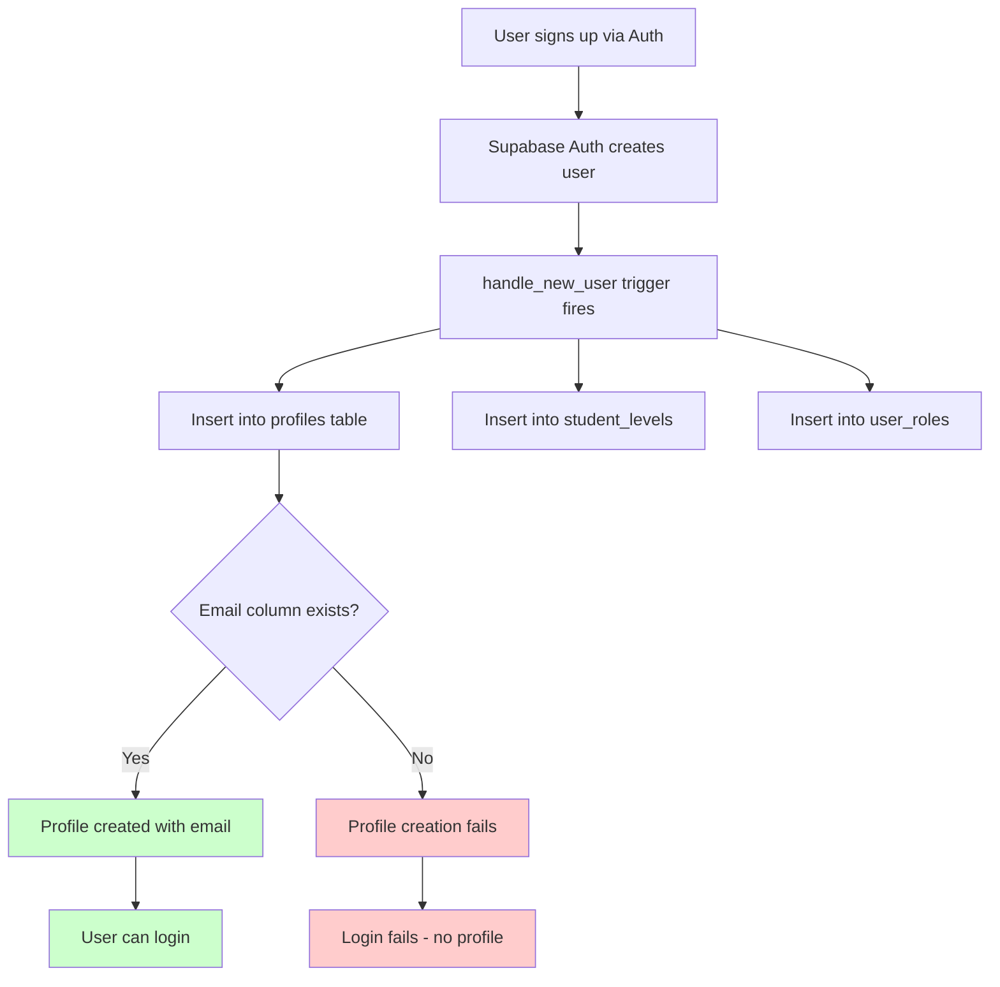

# Supabase Migration Issues - Fix Plan

## Executive Summary

After analyzing the codebase and migration files, I've identified **5 critical issues** preventing user login and account creation:

1. **Missing `email` column** in profiles table - code queries by email but column doesn't exist
2. **RLS policy gaps** - Missing INSERT policies preventing profile creation
3. **Trigger issues** - The auto-create profile trigger may not properly handle all cases
4. **parent_child_links INSERT policy missing** - Code can't create parent-child links
5. **Code/schema mismatch** - TypeScript types don't include email field

---

## Root Cause Analysis

### Issue 1: Missing email column in profiles table

**Problem**: The [`profile.ts:58`](src/lib/supabase/profile.ts:58) queries profiles by email:
```typescript
.eq('email', parentEmail)
```
But the migration files show profiles table has NO email column.

**Migration Analysis**:
- [`20240101000000_unified_schema.sql`](supabase/migrations/20240101000000_unified_schema.sql:2-15): Creates profiles WITHOUT email
- [`20251020134112_913fe607`](supabase/migrations/20251020134112_913fe607-af06-465d-a08c-5c07e6ff4553.sql:7-18): Also creates profiles WITHOUT email

**Code References**:
- [`profile.ts:58`](src/lib/supabase/profile.ts:58) - `linkParent` function queries by email
- [`parent.ts:16`](src/lib/supabase/parent.ts:16) - Accesses `profile.email`
- [`parent.ts:66`](src/lib/supabase/parent.ts:66) - Accesses `profile.email`

---

### Issue 2: RLS Policy Gaps

**Problem**: The trigger creates profiles, but there may be RLS issues preventing authenticated users from reading their own profile after creation.

**Current Policies** (from [`20240101000000_unified_schema.sql:126-139`](supabase/migrations/20240101000000_unified_schema.sql:126-139)):
- SELECT: Users can view own profile ✓
- UPDATE: Users can update own profile ✓
- INSERT: **MISSING** - Users can't insert their own profile (handled by trigger, but might need explicit policy)

---

### Issue 3: Missing parent_child_links INSERT Policy

**Problem**: [`profile.ts:65-70`](src/lib/supabase/profile.ts:65-70) tries to insert into `parent_child_links`:
```typescript
.from('parent_child_links')
.insert({ parent_id: parent.id, child_id: studentId })
```

But migration [`20240101000000_unified_schema.sql:217-219`](supabase/migrations/20240101000000_unified_schema.sql:217-219) only has SELECT policy:
```sql
CREATE POLICY "Parents view own links" ON parent_child_links FOR SELECT USING (auth.uid() = parent_id);
```
**Missing**: INSERT, UPDATE, DELETE policies

---

### Issue 4: Trigger Issues

**Current Trigger** ([`20251022121938_279fe641`](supabase/migrations/20251022121938_279fe641-189c-43d6-8c7a-8dcac4f71628.sql:2-17)):
```sql
CREATE OR REPLACE FUNCTION public.handle_new_user()
RETURNS trigger
LANGUAGE plpgsql
SECURITY DEFINER
SET search_path = public
AS $$
BEGIN
  INSERT INTO public.profiles (id, full_name, role)
  VALUES (
    new.id,
    COALESCE(new.raw_user_meta_data->>'full_name', 'User'),
    COALESCE((new.raw_user_meta_data->>'role')::public.user_role, 'student')
  );
  RETURN new;
END;
$$;
```

**Potential Issues**:
1. Trigger runs AFTER INSERT on auth.users - if Supabase Auth is configured differently, may not fire
2. No error handling - if trigger fails silently, user has no profile
3. No student_levels creation in this version

---

### Issue 5: Code/Schema Type Mismatch

**Problem**: [`types.ts:12-26`](src/integrations/supabase/types.ts:12-26) doesn't include email in profiles:
```typescript
export interface Database {
  public: {
    Tables: {
      profiles: {
        Row: {
          id: string
          full_name: string | null  // No email!
          // ...
        }
      }
    }
  }
}
```

But code expects email to exist.

---

## Solution: SQL Migration

Create a new migration file with all fixes:

```sql
-- ============================================
-- MIGRATION: Fix Supabase Auth Issues
-- Created: 2026-03-21
-- Purpose: Fix login/account creation issues
-- ============================================

-- ============================================
-- STEP 1: Add email column to profiles table
-- ============================================
ALTER TABLE public.profiles 
ADD COLUMN IF NOT EXISTS email TEXT UNIQUE;

-- Copy email from auth.users if available
UPDATE public.profiles p
SET email = au.email
FROM auth.users au
WHERE p.id = au.id AND au.email IS NOT NULL;

-- ============================================
-- STEP 2: Fix and enhance the handle_new_user trigger
-- ============================================
CREATE OR REPLACE FUNCTION public.handle_new_user()
RETURNS trigger
LANGUAGE plpgsql
SECURITY DEFINER
SET search_path = public
AS $$
BEGIN
  -- Insert profile with email from auth.users
  INSERT INTO public.profiles (id, full_name, role, email)
  VALUES (
    new.id,
    COALESCE(new.raw_user_meta_data->>'full_name', 'User'),
    COALESCE((new.raw_user_meta_data->>'role')::public.user_role, 'student'),
    new.email
  )
  ON CONFLICT (id) DO UPDATE SET
    full_name = COALESCE(EXCLUDED.full_name, public.profiles.full_name),
    role = COALESCE(EXCLUDED.role, public.profiles.role),
    email = COALESCE(EXCLUDED.email, public.profiles.email);

  -- Create student_levels if doesn't exist
  INSERT INTO public.student_levels (user_id, points, level, badges)
  VALUES (new.id, 0, 1, ARRAY[]::text[])
  ON CONFLICT (user_id) DO NOTHING;

  -- Also add to user_roles table if exists
  INSERT INTO public.user_roles (user_id, role)
  VALUES (
    new.id,
    COALESCE((new.raw_user_meta_data->>'role')::public.app_role, 'student'::public.app_role)
  )
  ON CONFLICT (user_id, role) DO NOTHING;

  RETURN new;
END;
$$;

-- ============================================
-- STEP 3: Add RLS policies for profiles
-- ============================================

-- Enable RLS if not already enabled
ALTER TABLE public.profiles ENABLE ROW LEVEL SECURITY;

-- Add INSERT policy (allows trigger to work properly)
DROP POLICY IF EXISTS "Users can insert their own profile" ON public.profiles;
CREATE POLICY "Users can insert their own profile"
  ON public.profiles FOR INSERT
  WITH CHECK (auth.uid() = id);

-- Ensure SELECT works for authenticated users
DROP POLICY IF EXISTS "Users can view own profile" ON public.profiles;
CREATE POLICY "Users can view own profile"
  ON public.profiles FOR SELECT
  USING (auth.uid() = id);

-- Ensure UPDATE works for authenticated users  
DROP POLICY IF EXISTS "Users can update own profile" ON public.profiles;
CREATE POLICY "Users can update own profile"
  ON public.profiles FOR UPDATE
  USING (auth.uid() = id);

-- ============================================
-- STEP 4: Add RLS policies for parent_child_links
-- ============================================

ALTER TABLE public.parent_child_links ENABLE ROW LEVEL SECURITY;

-- SELECT - parents can view their links
DROP POLICY IF EXISTS "Parents view own links" ON public.parent_child_links;
CREATE POLICY "Parents view own links"
  ON public.parent_child_links FOR SELECT
  USING (auth.uid() = parent_id);

-- SELECT - students can view their links
CREATE POLICY "Students view own links"
  ON public.parent_child_links FOR SELECT
  USING (auth.uid() = child_id);

-- INSERT - parents can create links
CREATE POLICY "Parents can create links"
  ON public.parent_child_links FOR INSERT
  WITH CHECK (auth.uid() = parent_id);

-- DELETE - parents can delete their links
CREATE POLICY "Parents can delete links"
  ON public.parent_child_links FOR DELETE
  USING (auth.uid() = parent_id);

-- ============================================
-- STEP 5: Ensure auth.users is accessible
-- ============================================

-- Allow service role or authenticated users to read auth.users (for email lookup)
-- Note: This is typically handled by Supabase, but ensure trigger can access

-- ============================================
-- STEP 6: Create indexes for performance
-- ============================================
CREATE INDEX IF NOT EXISTS idx_profiles_email ON public.profiles(email);
CREATE INDEX IF NOT EXISTS idx_profiles_role ON public.profiles(role);
CREATE INDEX IF NOT EXISTS idx_parent_child_links_parent ON public.parent_child_links(parent_id);
CREATE INDEX IF NOT EXISTS idx_parent_child_links_child ON public.parent_child_links(child_id);

-- ============================================
-- STEP 7: Grant necessary permissions
-- ============================================

-- Grant execute on functions
GRANT EXECUTE ON FUNCTION public.handle_new_user() TO authenticated;
GRANT EXECUTE ON FUNCTION public.handle_new_user() TO service_role;

GRANT EXECUTE ON FUNCTION public.handle_updated_at() TO authenticated;

-- Grant access to auth.users for profile creation (if needed)
-- This is usually handled by Supabase automatically
```

---

## Required Code Changes

### 1. Update TypeScript Types

Update [`src/integrations/supabase/types.ts`](src/integrations/supabase/types.ts:12-54):

```typescript
profiles: {
  Row: {
    id: string
    email: string | null  // ADD THIS
    full_name: string | null
    avatar_url: string | null
    bio: string | null
    grade_level: string | null
    gpa: number | null
    interests: string[] | null
    extracurriculars: string[] | null
    role: UserRole
    school_id: string | null
    created_at: string
    updated_at: string
  }
  // Also add to Insert and Update types
}
```

### 2. Update profile.ts - Fix linkParent function

The current implementation queries by email, which works after migration. No code change needed IF email column is added.

### 3. Update parent.ts - Handle missing email gracefully

```typescript
// In getChildren function (line 16)
// Change: email: profile.email
// To: email: (profile as any).email || 'No email'
```

---

## Migration Execution Order

1. **Execute SQL migration** - Run the SQL above in Supabase SQL Editor
2. **Update TypeScript types** - Add email to profile type definition
3. **Test login flow** - Verify new users can sign up and existing users can log in
4. **Test parent linking** - Verify parent can link to student

---

## Verification Steps

After applying fixes, verify:

1. ✅ New user signup creates profile automatically
2. ✅ User can log in with email/password
3. ✅ User profile contains email from auth.users
4. ✅ Parent can search for child by email
5. ✅ Parent-child link can be created
6. ✅ R policies work correctly for all user roles

---

## Mermaid Diagram: User Signup Flow



---

## Summary of Changes Required

| Item | Type | File | Change |
|------|------|------|--------|
| 1 | SQL | New migration | Add email column, fix trigger, add RLS policies |
| 2 | Code | types.ts | Add email to Profile type |
| 3 | Code | parent.ts | Handle missing email gracefully |

---

## Risk Assessment

- **Low Risk**: Adding email column (non-breaking change)
- **Low Risk**: Adding RLS policies (more secure)
- **Medium Risk**: Trigger modification (test in staging first)
- **No Risk**: TypeScript type updates (only affects developer experience)

---

## Next Steps

1. **Approve this plan** - Review and confirm SQL changes
2. **Execute migration** - Run SQL in Supabase dashboard
3. **Update code** - Apply TypeScript changes
4. **Test thoroughly** - Verify all auth flows work
5. **Monitor** - Watch for any auth-related errors in logs
